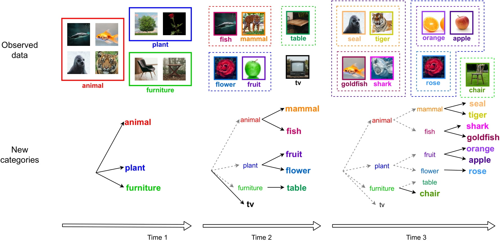
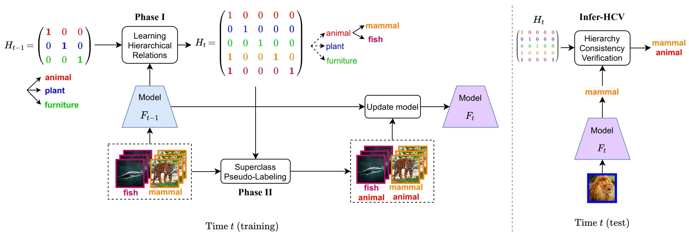

# HCV_IIRC
 code for our BMVC 2021 paper [HCV: Hierarchy-Consistency Verification for Incremental Implicitly-Refined Classification](https://arxiv.org/abs/2110.11148) by [Kai Wang](https://wangkai930418.github.io/), [Xialei Liu](https://xialeiliu.github.io/), [Luis Herranz](http://www.lherranz.org/) and [Joost van de Weijer](http://www.cvc.uab.es/LAMP/joost/).

## IIRC setup

## Our proposal: HCV 

## Reproducing

The code is base on IIRC: Incremental Implicitly-Refined Classification(https://github.com/chandar-lab/IIRC)

You need to first download cifar100 (https://www.cs.toronto.edu/~kriz/cifar.html), then place it in this repository as:

|-- cifar100/cifar-100-python/
    |-- meta
    |-- test
    |-- train

Then run the script as below:

'''
bash ./iirc_2_cifar_scripts.sh
'''